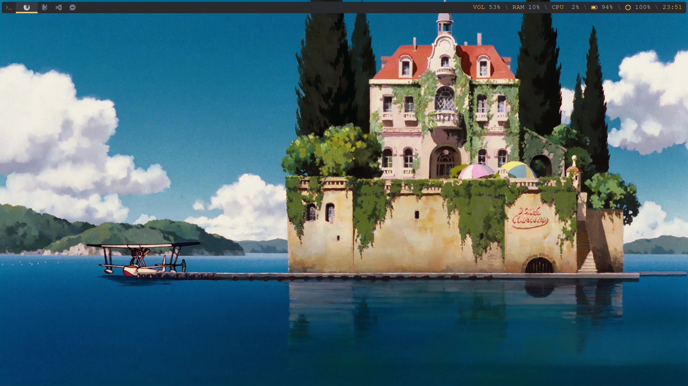
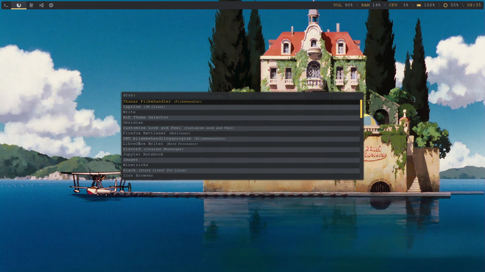
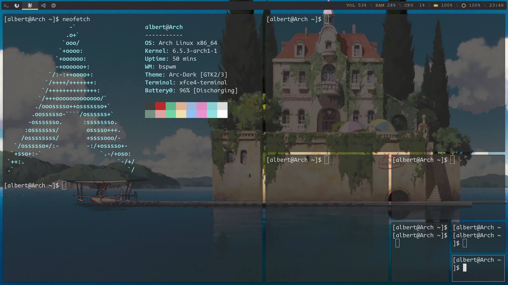

# dotfiles

Simple configuration files 

|Distro|[Arch](https://archlinux.org/)|
|:---:|:---:|
|WM|[BSPWM](https://github.com/baskerville/bspwm)|
|Bar|[Polybar](https://github.com/polybar/polybar)|
|Menu|[Rofi](https://github.com/davatorium/rofi)|
|Editor|[Neovim](https://neovim.io/)|
|Compositor|[Picom](https://archlinux.org/packages/community/x86_64/picom/)|
|Terminal|[xfce4-terminal](https://github.com/alacritty/alacritty)|
|File Manager|[Thunar](https://archlinux.org/packages/extra/x86_64/thunar/)|

